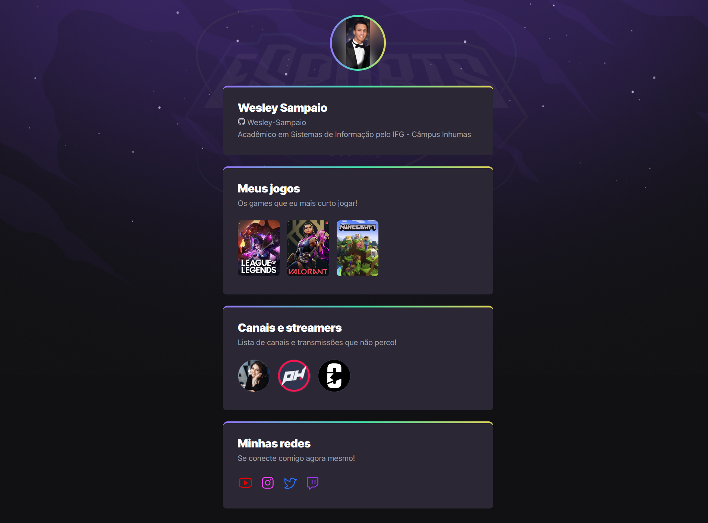

<h1 align="center">
  Game Hub
</h1>

  <a href="#-tecnologias">Tecnologias</a>&nbsp;&nbsp;&nbsp;|&nbsp;&nbsp;&nbsp;
  <a href="#-projeto">Projeto</a>&nbsp;&nbsp;&nbsp;|&nbsp;&nbsp;&nbsp;
  <a href="#-layout">Layout</a>

 

  

## :memo: Descrição

## :wrench: Tecnologias utilizadas
* [HTML]
* [CSS]
* [JavaScript]

## 💻 Projeto

...

## 🔖 Layout
Você pode visualizar o layout do projeto através [desse link](<https://www.figma.com/community/file/1152743024964543316?fuid=1024368472305058299>). É necessário ter conta no [Figma](https://figma.com) para acessá-lo.

---
